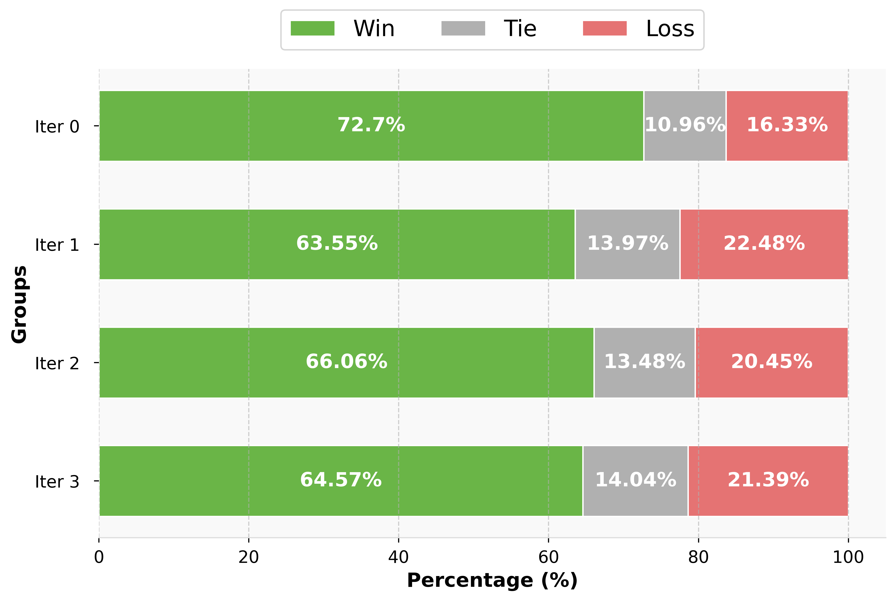

## Dataset
### SPIN-generated Data
[zephyr-7b-sft-full](https://huggingface.co/datasets/joyfine/SPIN-generated-zephyr-7b-sft-full), [Llama-2-7b-ultrachat200k](https://huggingface.co/datasets/joyfine/SPIN-generated-Llama-2-7b-ultrachat200k)

### GPT-Score Data
[zephyr-7b-sft-full](https://huggingface.co/datasets/joyfine/gpt-score-zephyr-7b-sft-full), [Llama-2-7b-ultrachat200k](https://huggingface.co/datasets/joyfine/gpt-score-Llama-2-7b-ultrachat200k)

### SPIN-GPT-preference Data
[zephyr-7b-sft-full](https://huggingface.co/datasets/joyfine/SPIN-GPT-preference-zephyr-7b-sft-full), [Llama-2-7b-ultrachat200k](https://huggingface.co/datasets/joyfine/SPIN-GPT-preference-Llama-2-7b-ultrachat200k)

## Model
### Fine-tuned by SPIN-generated Data

#### zephyr-7b-sft-full
[Iter0](https://huggingface.co/joyfine/zephyr-7b-sft-full-SPIN-iter0), [Iter1](https://huggingface.co/joyfine/zephyr-7b-sft-full-SPIN-iter1), [Iter2](https://huggingface.co/joyfine/zephyr-7b-sft-full-SPIN-iter2), [Iter3](https://huggingface.co/joyfine/zephyr-7b-sft-full-SPIN-iter3)

#### Llama-2-7b-ultrachat200k

[Iter0](https://huggingface.co/joyfine/Llama-2-7b-ultrachat200k-SPIN-iter0), [Iter1](https://huggingface.co/joyfine/Llama-2-7b-ultrachat200k-SPIN-iter1), [Iter2](https://huggingface.co/joyfine/Llama-2-7b-ultrachat200k-SPIN-iter2),
[Iter3](https://huggingface.co/joyfine/Llama-2-7b-ultrachat200k-SPIN-iter3)

## Files
`csv_big_spender.py`: 

## SPIN results

### zephyr-7b-sft-full

| Task               | arc-challenge(25) | arc-easy(25) | truhfulqa-mc1(0) | truhfulqa-mc2(0) | winogrande(5) | gsm8k(5) | hellaswag(10) | mmlu(5) | Average |
|--------------------|-------------------|--------------|------------------|------------------|---------------|----------|---------------|---------|---------|
| SFT            | 0.5708            | 0.8375       | 0.2778           | 0.4038           | 0.7616        | 0.3184   | 0.8102        | 0.5877  | 0.5710  |
| SPIN-iter0            | 0.5922            | 0.8266       | 0.3244           | 0.4615           | 0.7680        | 0.2889   | 0.8260        | 0.5901  | 0.5847  |
| SPIN-iter1            | 0.5853            | 0.8203       | 0.2901           | 0.4341           | 0.7601        | 0.3161   | 0.8172        | 0.5846  | 0.5760  |
| SPIN-iter2            | 0.5904            | 0.8241       | 0.3072           | 0.4328           | 0.7609        | 0.2760   | 0.8197        | 0.5850  | 0.5745  |
| SPIN-iter3            | 0.5819            | 0.8245       | 0.3146           | 0.4515           | 0.7561        | 0.2752   | 0.8181        | 0.5786  | 0.5751  |

### Llama-2-7b-ultrachat200k
| Task               | arc-challenge(25) | arc-easy(25) | truhfulqa-mc1(0) | truhfulqa-mc2(0) | winogrande(5) | gsm8k(5) | hellaswag(10) | mmlu(5) | Average |
|--------------------|-------------------|--------------|------------------|------------------|---------------|----------|---------------|---------|---------|
| SFT          | 0.5290            | 0.8253       | 0.3121           | 0.4494           | 0.7230        | 0.1372   | 0.7619        | 0.4479  | 0.5232  |
| SPIN-iter0            | 0.5360            | 0.8291       | 0.3439           | 0.5055           | 0.7348        | 0.1516   | 0.7735        | 0.4478  | 0.5403  |
| SPIN-iter1            | 0.5333            | 0.8312       | 0.3427           | 0.5066           | 0.7269        | 0.1706   | 0.7727        | 0.4509  | 0.5419  |
| SPIN-iter2             | 0.5418            | 0.8325       | 0.3476           | 0.5086           | 0.7167        | 0.1592   | 0.7718        | 0.4524  | 0.5413  |
| SPIN-iter3             | 0.5461            | 0.8329       | 0.3439           | 0.5078           | 0.7151        | 0.1577   | 0.7714        | 0.4511  | 0.5408  |

## Problems of SPIN - performance oscillation

### zephyr-7b-sft-full

### Llama-2-7b-ultrachat200k

## Potential Methods

### 1. Use GPT to label the pair (combine the reward plot)

| Task               | arc-challenge(25) | arc-easy(25) | truhfulqa-mc1(0) | truhfulqa-mc2(0) | winogrande(5) | gsm8k(5) | hellaswag(10) | mmlu(5) | Average |
|--------------------|-------------------|--------------|------------------|------------------|---------------|----------|---------------|---------|---------|
| Zephyr-SPIN-iter1         | 0.5853            | 0.8203       | 0.2901           | 0.4341           | 0.7601        | 0.3161   | 0.8172        | 0.5846  | 0.5760  |
| GPT-Zephyr-SPIN-iter1        | 0.5939            | 0.8270       | 0.3133           | 0.4407           | 0.7672        | 0.3169   | 0.8229        | 0.5855  | 0.5834  |

### 2. Add noise

| Task               | arc-challenge(25) | arc-easy(25) | truhfulqa-mc1(0) | truhfulqa-mc2(0) | winogrande(5) | gsm8k(5) | hellaswag(10) | mmlu(5) | Average |
|--------------------|-------------------|--------------|------------------|------------------|---------------|----------|---------------|---------|---------|
| Zephyr-SPIN-iter1         | 0.5853            | 0.8203       | 0.2901           | 0.4341           | 0.7601        | 0.3161   | 0.8172        | 0.5846  | 0.5760  |
| Noised-Zephyr-SPIN-iter1       | 0.5930            | 0.8258       | 0.3035           | 0.4469           | 0.7640        | 0.3275   | 0.8214        | 0.5880  | 0.5838  |

## Feture Work - Combind the two ideas, adaptive judge or noise

